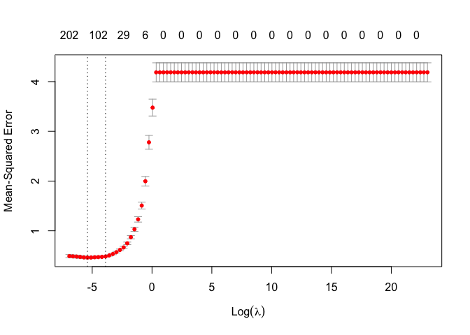
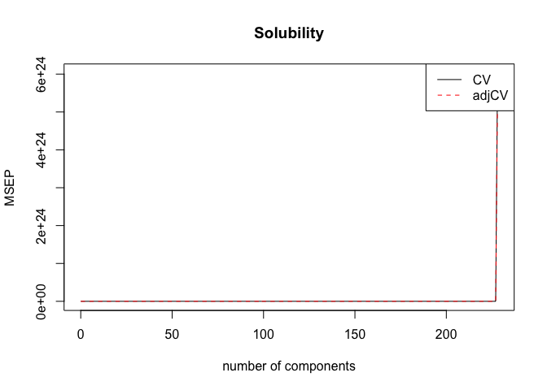

Homework1
================
Shenglin Liu sl4659
2/26/2020

# Part a

``` r
library(tidyverse)
```

    ## ── Attaching packages ────────────────────────────────────────────────────────── tidyverse 1.2.1 ──

    ## ✔ ggplot2 3.2.1     ✔ purrr   0.3.3
    ## ✔ tibble  2.1.3     ✔ dplyr   0.8.3
    ## ✔ tidyr   1.0.0     ✔ stringr 1.4.0
    ## ✔ readr   1.3.1     ✔ forcats 0.4.0

    ## ── Conflicts ───────────────────────────────────────────────────────────── tidyverse_conflicts() ──
    ## ✖ dplyr::filter() masks stats::filter()
    ## ✖ dplyr::lag()    masks stats::lag()

``` r
library(ModelMetrics)
```

    ## 
    ## Attaching package: 'ModelMetrics'

    ## The following object is masked from 'package:base':
    ## 
    ##     kappa

``` r
# load data
test = read_csv("./data/solubility_test.csv")
```

    ## Parsed with column specification:
    ## cols(
    ##   .default = col_double()
    ## )

    ## See spec(...) for full column specifications.

``` r
train = read_csv("./data/solubility_train.csv")
```

    ## Parsed with column specification:
    ## cols(
    ##   .default = col_double()
    ## )
    ## See spec(...) for full column specifications.

``` r
# fit a linear model using least squares
fit_ml = lm(Solubility ~ .-Solubility, data = train)
# summary(fit_ml)
# mse for training data
pred_ml_train = predict(fit_ml, train)
mse_ml_train = mse(train$Solubility, pred_ml_train)
mse_ml_train
```

    ## [1] 0.2316799

``` r
# calculate the mse using the test data
pred_ml  = predict(fit_ml, test)
mse_ml = mse(test$Solubility, pred_ml)
mse_ml
```

    ## [1] 0.5558898

# Part b

``` r
library(ISLR)
library(glmnet)
```

    ## Loading required package: Matrix

    ## 
    ## Attaching package: 'Matrix'

    ## The following objects are masked from 'package:tidyr':
    ## 
    ##     expand, pack, unpack

    ## Loaded glmnet 3.0-1

``` r
library(caret)
```

    ## Loading required package: lattice

    ## 
    ## Attaching package: 'caret'

    ## The following objects are masked from 'package:ModelMetrics':
    ## 
    ##     confusionMatrix, precision, recall, sensitivity, specificity

    ## The following object is masked from 'package:purrr':
    ## 
    ##     lift

``` r
# fit the ridge regression (alpha = 0) with a sequence of lambdas
x.train = as.matrix(subset(train, select = -Solubility))
y.train = train$Solubility
# cross-validation
set.seed(1)
cv.ridge = cv.glmnet(x.train, y.train, type.measure = "mse", alpha = 0, lambda = 10^seq(10, -3, length = 100))
plot(cv.ridge)
```

<!-- -->

``` r
# best lambda
best.ridge = cv.ridge$lambda.min
best.ridge
```

    ## [1] 0.06892612

``` r
# mse for training data
pred_ridge_train = predict(cv.ridge, s = best.ridge, newx = x.train)
mse_ridge_train = mse(train$Solubility, pred_ridge_train)
mse_ridge_train
```

    ## [1] 0.2932181

``` r
# test error
x.test = as.matrix(subset(test, select = -Solubility))
pred_ridge = predict(cv.ridge, s = best.ridge, newx = x.test)
mse_ridge = mse(test$Solubility, pred_ridge)
mse_ridge
```

    ## [1] 0.5121138

# Part c

``` r
# cross-validation
set.seed(1)
cv.lasso  = cv.glmnet(x.train, y.train, alpha = 1, lambda = 10^seq(10, -3, length = 100))
plot(cv.lasso)
```

<!-- -->

``` r
# best lambda
best.lasso = cv.lasso$lambda.min
best.lasso
```

    ## [1] 0.004534879

``` r
# mse for training data
pred_lasso_train = predict(cv.lasso, s = best.lasso, newx = x.train)
mse_lasso_train = mse(train$Solubility, pred_lasso_train)
mse_lasso_train
```

    ## [1] 0.3017123

``` r
# test error
pred_lasso = predict(cv.lasso, s = best.lasso, newx = x.test)
mse_lasso = mse(test$Solubility, pred_lasso)
mse_lasso
```

    ## [1] 0.4998646

``` r
# coefficients of the final model
# predict(cv.lasso, s = "lambda.min", type = "coefficients")
```

# Part d

``` r
library(pls)
```

    ## 
    ## Attaching package: 'pls'

    ## The following object is masked from 'package:caret':
    ## 
    ##     R2

    ## The following object is masked from 'package:stats':
    ## 
    ##     loadings

``` r
# fit PCR model using the function pcr()
set.seed(1)
fit.pcr = pcr(Solubility ~ .-Solubility, data = train, scale = TRUE, validation = "CV")
# summary(fit.pcr)
validationplot(fit.pcr, val.type = "MSEP", legendpos = "topright")
```

<!-- -->

``` r
cv.mse  = RMSEP(fit.pcr)
ncomp.cv = which.min(cv.mse$val[1,,])-1
ncomp.cv
```

    ## 152 comps 
    ##       152

``` r
# mse for training data
pred_pc_train = predict(fit.pcr, newdata = train, ncomp = ncomp.cv)
mse_pc_train = mse(train$Solubility, pred_pc_train)
mse_pc_train
```

    ## [1] 0.3295866

``` r
# test error
pred_pc = predict(fit.pcr, newdata = test, ncomp = ncomp.cv)
mse_pc = mse(test$Solubility, pred_pc)
mse_pc
```

    ## [1] 0.5477905

# Part e

For ridge regression, the optimal lambda chosen is 0.0689261. For lasso,
the optimal lambda chosen is 0.0045349. For principal component
regression, the value of M chosen is 152. After using the test data to
calculate the mean square error for the four models (linear = 0.5558898,
ridge = 0.5121138, lasso = 0.4998646, principal component = 0.5477905),
lasso has the smallest test error.

# Part f

I will choose the linear regression model for predicting solubility.
First of all, it yields the smallest mse on the training dataset (linear
= 0.2316799, ridge = 0.2932181, lasso = 0.3017123, principal component =
0.3295866). Moreover, the linear regression model also has higher
interpretability.
